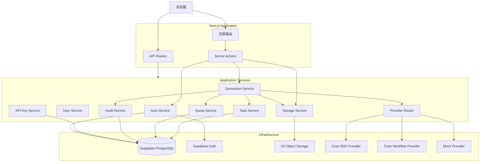
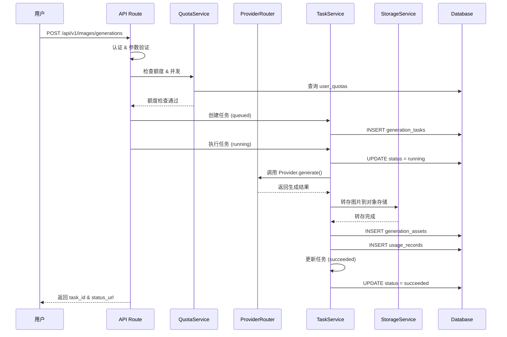
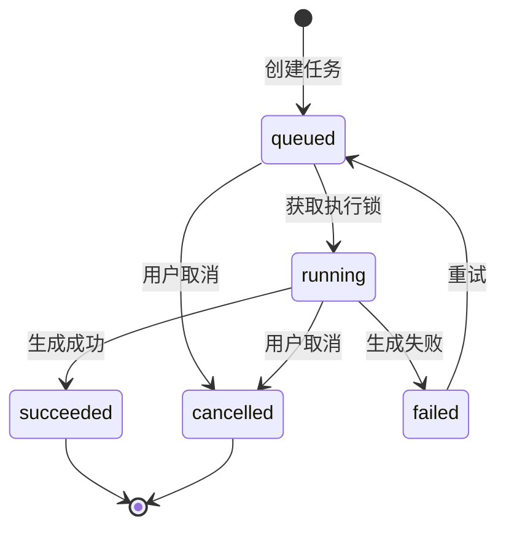

# 架构文档

## 系统架构



## 核心流程

### 图像生成流程



### 任务状态机



## Provider 适配层

所有模型调用通过 `ImageGenerationProvider` 接口隔离：

```typescript
interface ImageGenerationProvider {
  getCapabilities(): Promise<ProviderCapabilities>;
  generate(request: ProviderGenerationRequest): Promise<ProviderGenerationResult>;
  healthCheck(): Promise<ProviderHealthResult>;
}
```

三种实现：
1. **CozeCodingProvider** - 使用 `coze-coding-dev-sdk` 的 `images.generate()`
2. **CozeWorkflowProvider** - 调用扣子工作流 OpenAPI
3. **MockProvider** - 返回占位图，用于开发和测试

Provider 由 `model_configs.provider_type` 动态选择，未来添加新 Provider 不需要修改业务代码。

## 安全架构

- 所有模型调用在服务端执行
- API Key 只保存哈希，明文仅创建时展示一次
- Supabase Auth 管理用户认证
- RLS 保护数据库行级访问
- Signed URL 短时效，不永久存储
- 审计日志记录所有管理操作
- 日志自动脱敏敏感字段

## 部署架构

项目以 Next.js 单体部署，平台自动构建和运行。

- 开发环境: `pnpm dev` (端口 5000)
- 生产环境: `pnpm build && pnpm start`
- 数据库: Supabase PostgreSQL (平台托管)
- 对象存储: S3 兼容存储 (平台托管)
- 认证: Supabase Auth (平台托管)
